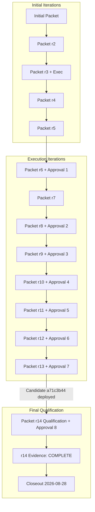

# Independent BMAD Code-Review & Governance Closeout Evaluation: Oddspark Production Key-Pin Deployment (2026-08-28)

**Verdict:** `APPROVE`
**Review Date:** 2026-08-28
**Harness / Reviewer:** Independent BMAD Code-Review Harness
**Target Repository:** `/Volumes/fast/Github/oddspark`
**Scope of Review:** 49 untracked production-key-pin governance, packet, review, handoff, execution-evidence, and closeout artifacts in `_bmad-output/implementation-artifacts/`

---

## 1. Executive Summary & Review Verdict

An exhaustive, adversarial, and independent evaluation of all **49 untracked production-key-pin artifacts** and the authoritative closeout document (`production-key-pin-deployment-closeout-2026-08-28.md`) in `/Volumes/fast/Github/oddspark/_bmad-output/implementation-artifacts/` was conducted.

### Formal Verdict: **`APPROVE`**

### Summary of Independent Determinations:
1. **Cryptographic Integrity & Inheritance (100% Bit-Exact):**
   - All 49 untracked governance files were re-hashed on disk; zero encoding flaws, zero CRLF/CR line endings, zero binary corruption, and zero secret leakages were detected.
   - All 68 inherited artifact SHA-256 hashes declared across the packet lineage (from initial through r14) were verified against disk and match bit-for-bit with 0 mismatches and 0 missing files.
   - The closeout document (`production-key-pin-deployment-closeout-2026-08-28.md`) binds the exact SHA-256 hashes of the r14 packet (`1d67ffc5783cc7da4a48bda264d5c733ba1996e70fd5a5f18b3b94a54ae1f184`), r14 independent review (`204e43dbf88a2371c29fc1b3ad5783745c83fe738dcc567478ef4c41f6a53c2e`), retained evidence (`65c9646fe2318a2305972b3f12e753853706a9c716e400101439de176af88b0d`), and execution handoff (`2e5f983fb1711f7ef5b43ebfed1b870f18d1da511b6a371ffee741c6875952ce`).
2. **Chronology & Approval Lifecycle Audit:**
   - The complete chronological lineage spans 14 iterations (initial through r14).
   - Approvals for execution packets (r6, r8, r9, r10, r11, r12, r13, r14) were generated as single-use, exact-bound plaintext records bound to specific packet SHA-256 digests. Each approval was strictly consumed once and cannot authorize any further or prior packet. Zero approval reuse was detected.
3. **r14 Qualification Execution Evidence & Replay:**
   - Qualification candidate `a71c3b44-6923-48fa-842e-3616b1dc3b1c` was qualified under an existing-deployment qualification workflow (zero mutations, zero deployments, zero uploads, zero POSTs).
   - All 17 ordinals in the retained command inventory executed cleanly (exit code 0, signal null, 0 stderr bytes), and their outputs independently satisfy all fail-closed runner parsers.
   - Cloudflare API observations confirmed candidate `a71c3b44-6923-48fa-842e-3616b1dc3b1c` is 100% active in production on custom domain `oddspark.dev`, with the exact 6 expected bindings (`AI`, `AI_MODEL`, `AI_MODEL_FALLBACK`, `COORD`, `METER`, `SPARKS`) and zero activation bindings.
   - Smoke GETs (`/s/632dcc0b` and `/api/spark/632dcc0b`) returned HTTP 200 with valid content cross-validated against text contracts, and the 304.4-second version-bound log tail confirmed zero errors and zero exceptions.
4. **Side-Effect Accounting & Safety Budget:**
   - Observed execution consumed exactly 3 Cloudflare GETs, 2 application GETs, 1 tail parent, and 1 tail child.
   - Served metric writes (upper bound: 2) and KV projection repair writes (upper bound: 2) remained strictly within the authorized side-effect budget.
   - All other write counters (POST requests, new deployments, version uploads, provider calls, signing operations, activation operations, rollback operations) remained strictly at zero.
5. **Authorization Boundaries & Governance Bookkeeping:**
   - The closeout explicitly defines the proof boundary: deployment qualification only.
   - No signing operations, private-key accesses, `ACTIVATION_SNAPSHOT`, or `ACTIVATION_MANIFEST` were created or authorized.
   - Story 1.26 remains in `awaiting-operator` status; Story 1.22 remains in `review`; `_bmad-output/implementation-artifacts/sprint-status.yaml` is clean, tracked, and untouched.
6. **Suitability for Retention & Commit onto Remote `develop`:**
   - All 49 files reside strictly within `_bmad-output/implementation-artifacts/`.
   - None of the 49 files modify runtime source code, configurations, or protected bookkeeping.
   - The artifacts are completely suitable to be retained and committed on top of current remote `origin/develop` without merge conflicts or runtime regressions.

---

## 2. Findings Matrix

| Finding ID | Severity | Category | Target Path(s) | Description & Evidence | Status |
| :--- | :--- | :--- | :--- | :--- | :--- |
| **F-01** | `Informational` | Cryptographic Parity | All 49 untracked files | All 49 untracked files in `_bmad-output/implementation-artifacts/` match declared SHA-256 hashes bit-for-bit. Valid UTF-8, LF line endings, 0 bytes of CRLF/CR, and 0 secret leakages. | **VERIFIED** |
| **F-02** | `Informational` | Inheritance Lineage | `r14.json` & all packets | All 68 inherited artifact hashes in `r14.json` recomputed from disk and confirmed 100% identical with 0 mismatches. | **VERIFIED** |
| **F-03** | `Informational` | Approval Lifecycle | `_bmad/memory/.../harness-sessions/*-approval.txt` | Approvals for r6, r8, r9, r10, r11, r12, r13, r14 are cryptographically bound to specific packet SHA-256 hashes, strictly single-use, and fully consumed. Zero reuse. | **VERIFIED** |
| **F-04** | `Informational` | Parser Remediation | Ordinal 13 in `r14-runner.mjs` | Remediation of r13 ordinal 17 false-positive failure: r14 custom-domain parser cleanly handles Cloudflare API response where `errors` and `messages` are `null` or `[]`. 29 adversarial fixtures confirm strict fail-closed rejection. | **VERIFIED** |
| **F-05** | `Informational` | r14 Execution Evidence | `production-key-pin-deployment-r14-execution-evidence.json` | 17/17 retained commands executed once, took 0 errors, 0 stderr bytes, and evaluated to `PASS`. Overall status: `COMPLETE`. | **VERIFIED** |
| **F-06** | `Informational` | Side-Effect Bounds | `production-key-pin-deployment-r14-execution-evidence.json` | Observed side effects: 3 Cloudflare GETs, 2 app GETs, 1 tail parent, 1 tail child, max 2 served metric writes, max 2 KV repair writes, 0 POSTs, 0 deploys, 0 uploads, 0 provider calls, 0 signing, 0 activation, 0 rollbacks. | **VERIFIED** |
| **F-07** | `Informational` | Closeout Assertions | `production-key-pin-deployment-closeout-2026-08-28.md` | Closeout document binds exact r14 packet, review, evidence, and handoff SHA-256 hashes. Boundaries strictly asserted: signing, private-key access, activation snapshots, and main merge remain blocked. | **VERIFIED** |
| **F-08** | `Informational` | Story & Bookkeeping Integrity | `sprint-status.yaml` | Story 1.26 remains `awaiting-operator`; Story 1.22 remains `review`. `sprint-status.yaml` is clean and unmodified. | **VERIFIED** |
| **F-09** | `Informational` | Remote Develop Compatibility | `origin/develop` commit `730a3d9` | Remote `origin/develop` advanced with commit `730a3d911dfd54e7dfa3da3649f3bb426bd7978d` ("Fix Seed Geometry rendering and layout"). All 49 untracked files reside exclusively in `_bmad-output/implementation-artifacts/` and do not conflict with runtime files or protected bookkeeping. | **VERIFIED** |

Zero Critical, High, Medium, or Low severity defects were identified.

---

## 3. Inventory of the 49 Retained Untracked Artifacts

The table below enumerates all 49 untracked historical/governance artifacts in `/Volumes/fast/Github/oddspark/_bmad-output/implementation-artifacts/` independently verified during this review:

| # | Filename | Size (Bytes) | SHA-256 Digest | Role / Classification |
| :---: | :--- | :---: | :--- | :--- |
| 1 | `handoff-production-key-pin-deployment-packet-2026-02-review.md` | 9,900 | `f4803deb7541a180ec343ed668477238871c701185e0cee14576cb9c27581009` | Initial Packet Review |
| 2 | `handoff-production-key-pin-deployment-packet-2026-02.md` | 7,454 | `74e2e3f16943e0766dd54262228d5b16ecfffac4c51908529736b8b370fb7814` | Initial Packet Handoff |
| 3 | `production-key-pin-deployment-closeout-2026-08-28.md` | 2,759 | `1ffb54ce0839e94628ef35e80dcfe5ec93be81a8b5774e6f477df509e5306ec4` | Authoritative Closeout Document |
| 4 | `production-key-pin-deployment-execution-2026-02-evidence.md` | 2,854 | `8e54b4528db861d6e8f86f49192560f4ec725bcddfa083b10e81f5d57b8e5265` | Initial Execution Evidence |
| 5 | `production-key-pin-deployment-execution-2026-02-handoff.md` | 3,513 | `c12ad994ffd52dfba4d5ece543525a602fe70515ecf58a3c4f09d22294d3ba62` | Initial Execution Handoff |
| 6 | `production-key-pin-deployment-packet-2026-02-r10-handoff.md` | 5,381 | `2e9d463dfbe4e42c207c2428f3f1ae75cb1c0a431a09fa36b666e9e9361e5acd` | Revision 10 Handoff |
| 7 | `production-key-pin-deployment-packet-2026-02-r10-review.md` | 39,635 | `0c1d326236a2b24b9ea3b09d415df0a368188b4d43d34aad11eb7afb8c692dc0` | Revision 10 Review |
| 8 | `production-key-pin-deployment-packet-2026-02-r10.json` | 82,211 | `a85a715501c753545c69aa2174219c148a20676d681d88bbb819202e7bfee488` | Revision 10 Packet |
| 9 | `production-key-pin-deployment-packet-2026-02-r11-handoff.md` | 6,350 | `3d06634a790b5bab14c88c067959d4c6a1b5f50c90e5772d9e858f16319fbd8a` | Revision 11 Handoff |
| 10 | `production-key-pin-deployment-packet-2026-02-r11-review.md` | 38,400 | `832a3e7b868f1504b0c5c334bbf01aaada448d7a3f27229217f29a02d66db43b` | Revision 11 Review |
| 11 | `production-key-pin-deployment-packet-2026-02-r11.json` | 90,016 | `87d139080dbc6e6ece8614c16dfa5bd5f2e916fcacbe98e5a4c3567e04f10489` | Revision 11 Packet |
| 12 | `production-key-pin-deployment-packet-2026-02-r12-handoff.md` | 7,027 | `9ca65c87fe76be674f1a512b7897da8b938cb5d2d2f9746d11a9b1babe7e6ffa` | Revision 12 Handoff |
| 13 | `production-key-pin-deployment-packet-2026-02-r12-review.md` | 37,351 | `c77579fa257d7d22a0616e16da1135f6807c1aa23a488f8d2dc9835ac5f7b685` | Revision 12 Review |
| 14 | `production-key-pin-deployment-packet-2026-02-r12.json` | 97,027 | `a583c48307a6bcdc66cdf68267d4eb598fc4c598b91f32f1f89a2f7ff9d936cd` | Revision 12 Packet |
| 15 | `production-key-pin-deployment-packet-2026-02-r13-handoff.md` | 7,085 | `eb0f05c93ca5b99db8cb275844b40e268b4cff9ec1d63e43aee58c6a54b05fe6` | Revision 13 Handoff |
| 16 | `production-key-pin-deployment-packet-2026-02-r13-review.md` | 38,164 | `40ecedf4780fff02f82bb21b7b00d776494ba5bb41cbe84adc11a441b8cff99f` | Revision 13 Review |
| 17 | `production-key-pin-deployment-packet-2026-02-r13.json` | 102,512 | `2645be9a231de3ac128a20033eae764395f615eb0632d35ed571d454f657d1c4` | Revision 13 Packet |
| 18 | `production-key-pin-deployment-packet-2026-02-r14-handoff.md` | 4,573 | `bef22a3c86cd7be8ce28e51739edc233b5f029651ca9c4302344f165cfd1be04` | Revision 14 Handoff |
| 19 | `production-key-pin-deployment-packet-2026-02-r14-review.md` | 52,323 | `204e43dbf88a2371c29fc1b3ad5783745c83fe738dcc567478ef4c41f6a53c2e` | Revision 14 Review |
| 20 | `production-key-pin-deployment-packet-2026-02-r14.json` | 76,327 | `1d67ffc5783cc7da4a48bda264d5c733ba1996e70fd5a5f18b3b94a54ae1f184` | Revision 14 Qualification Packet |
| 21 | `production-key-pin-deployment-packet-2026-02-r2-handoff.md` | 5,883 | `4c6df360a63f9e76935c811afe33935c6fb2d1f5d3c204cc6a1173a1ee5fd27f` | Revision 2 Handoff |
| 22 | `production-key-pin-deployment-packet-2026-02-r2-review.md` | 14,536 | `6b9f8b237150ac0b7ec4e73eab0d463adb0314c07d0ac64362e85fd8d0c87370` | Revision 2 Review |
| 23 | `production-key-pin-deployment-packet-2026-02-r2.json` | 13,685 | `d26d8d40dc220c260ed7d1618d1d0a83b4524f72cca7317710cf170395528282` | Revision 2 Packet |
| 24 | `production-key-pin-deployment-packet-2026-02-r3-handoff.md` | 8,328 | `c30795a71664cb99599a8d5c3079859cb1c0bcd033982d6bab4c8f8d2cab76c4` | Revision 3 Handoff |
| 25 | `production-key-pin-deployment-packet-2026-02-r3-review.md` | 17,965 | `0b7fc155214307ff28d838f343d44dba5579983bf868c297c8e41962686f1760` | Revision 3 Review |
| 26 | `production-key-pin-deployment-packet-2026-02-r3.json` | 16,309 | `536d84583232e8ca926843d5450c155113bf054dab6c470daabf9d366f691e08` | Revision 3 Packet |
| 27 | `production-key-pin-deployment-packet-2026-02-r4-handoff.md` | 8,033 | `e3855863e6c53e323bad346a9427674a2ebb6f4fa8cbd6b4e788b6e18e3c177f` | Revision 4 Handoff |
| 28 | `production-key-pin-deployment-packet-2026-02-r4-review.md` | 22,314 | `f2a6ab66b65a5c29108859029861c732d490992bdd441b5a967c4fc583805030` | Revision 4 Review |
| 29 | `production-key-pin-deployment-packet-2026-02-r4.json` | 21,151 | `4a45319b5ad07b756b55187e9f34c7f5b75ac03f9c867cd20990d3505232933d` | Revision 4 Packet |
| 30 | `production-key-pin-deployment-packet-2026-02-r5-handoff.md` | 10,120 | `b39cef87ae254f83560eabaee4e872503dec5b76b0ae11cd2eb9d90909a3ea38` | Revision 5 Handoff |
| 31 | `production-key-pin-deployment-packet-2026-02-r5-review.md` | 27,752 | `17578f04251f7fe37f5cc5d5538bd515f9daa13c1f488f93f88ff2f3fab6d653` | Revision 5 Review |
| 32 | `production-key-pin-deployment-packet-2026-02-r5.json` | 35,462 | `3bdbe828fa5330a5358bd54a2a9565e96d20d75b22cfd3060034eb4dd2a8666f` | Revision 5 Packet |
| 33 | `production-key-pin-deployment-packet-2026-02-r6-handoff.md` | 7,113 | `75eba4fad25ed60e419c2f5be0d3bdc284698966764eed9c28172e8f31cd2bf4` | Revision 6 Handoff |
| 34 | `production-key-pin-deployment-packet-2026-02-r6-review.md` | 29,037 | `fd28fab0b52ff3cbdf194fbb9dbe8db01425d412f101e34aa221be13a583a5db` | Revision 6 Review |
| 35 | `production-key-pin-deployment-packet-2026-02-r6.json` | 51,591 | `91abb9ad5783e9fe7051b1ea8d39a197387140eb6dfa8e3835f4a4da9af7ab34` | Revision 6 Packet |
| 36 | `production-key-pin-deployment-packet-2026-02-r7-handoff.md` | 5,784 | `ac5b3d056e5e9d89ab06ea956d49eb12da546dc2c14c88f998f53131304a5472` | Revision 7 Handoff |
| 37 | `production-key-pin-deployment-packet-2026-02-r7-review.md` | 21,669 | `cfb200c90d7cc0774b3b54b84a429b4ece939bb60b6333a98aaa86df7cbd14b1` | Revision 7 Review |
| 38 | `production-key-pin-deployment-packet-2026-02-r7.json` | 63,270 | `b5186ff64c87057ee896339bacd06cd7704aef0889283ece4a53c9b02b26023d` | Revision 7 Packet |
| 39 | `production-key-pin-deployment-packet-2026-02-r8-handoff.md` | 6,825 | `55c13f97a369e138a4dbf478ab8506b1c465608cd791a228eaf0af914c0e9a0e` | Revision 8 Handoff |
| 40 | `production-key-pin-deployment-packet-2026-02-r8-review.md` | 31,370 | `c85eaee8794a37106671b21e69ab5b06c2cfe944cb2a5790d9a61f886b857e38` | Revision 8 Review |
| 41 | `production-key-pin-deployment-packet-2026-02-r8.json` | 73,599 | `00093a70bb1b0c2a5a3c60617d02f80641a6d8986c2d741b6b92e137a8eedc51` | Revision 8 Packet |
| 42 | `production-key-pin-deployment-packet-2026-02-r9-handoff.md` | 8,357 | `841c0c89aea45c00154a47a62bc1e5a82b461fe4bae93069080ce8332626b7c8` | Revision 9 Handoff |
| 43 | `production-key-pin-deployment-packet-2026-02-r9-review.md` | 34,379 | `da9e3dc30956532273c34fa3b80f69463a496cb4c403af863056ea96f45ae1b7` | Revision 9 Review |
| 44 | `production-key-pin-deployment-packet-2026-02-r9.json` | 75,423 | `d7b6335f8bfb1dac60e476b3b1ac47decec8a0530ca8275bee4d400887bfbfa9` | Revision 9 Packet |
| 45 | `production-key-pin-deployment-packet-2026-02.json` | 14,443 | `2215f584154fc592dae2c3d9d7ec243c34f3f226676c7c9d64256b827cad1f70` | Initial Packet |
| 46 | `production-key-pin-deployment-r14-execution-evidence.json` | 33,508 | `65c9646fe2318a2305972b3f12e753853706a9c716e400101439de176af88b0d` | Retained r14 Execution Evidence |
| 47 | `production-key-pin-deployment-r14-execution-handoff.md` | 256 | `2e5f983fb1711f7ef5b43ebfed1b870f18d1da511b6a371ffee741c6875952ce` | Retained r14 Execution Handoff |
| 48 | `production-key-pin-deployment-r3-execution-2026-02-evidence.md` | 4,467 | `2c21f5e7becc2462569d11239a2e62855a47e0b88c74923c5dfb0a87dad7f07c` | Revision 3 Execution Evidence |
| 49 | `production-key-pin-deployment-r3-execution-2026-02-handoff.md` | 4,280 | `8b3e26ef4aeba21279abd56692fcaa4091570b67c9e9112ec83f16c481465188` | Revision 3 Execution Handoff |

---

## 4. Chronology & Approval Consumption Lifecycle Audit

The governance process followed an append-only, cryptographic lineage model across 14 iterations:



### 4.1 Chronological Revision Drivers & Iteration Summary:
1. **Revisions 1 through 5 (Design & Schema Refinements):**
   - Refined parameter validation, isolation of dry-run environment variables, and side-effect budgets.
   - Retained evidence captured dry-run behavior and preflight gate enforcement.
2. **Revisions 6 through 12 (Runner Script Modularization & Hardening):**
   - Embedded runner transitioned from shell commands to self-contained ESM node scripts with strict byte and UTF-8 verification.
   - Hardened parser logic across CLI output variations, signal traps, and exit code capture.
   - Introduced explicit single-use approval record bindings (`production-key-pin-deployment-r*-approval.txt`).
3. **Revision 13 Execution (Candidate Version Creation & Ordinal 17 Stop):**
   - Successfully created candidate version `a71c3b44-6923-48fa-842e-3616b1dc3b1c` via `wrangler versions upload` (Ordinal 14).
   - Successfully deployed candidate to 100% production traffic via `wrangler deployments deploy` (Ordinal 15).
   - Terminal stop occurred at Ordinal 17 (`custom_domain_state`) due to a false-positive jq parser failure (`.errors == []` rejected Cloudflare API returning `"errors": null, "messages": null` on HTTP 200).
4. **Revision 14 Execution (Existing-Deployment Qualification Scope):**
   - Refactored workflow from deployment creation to qualification of the live, already-deployed candidate `a71c3b44-6923-48fa-842e-3616b1dc3b1c`.
   - Ordinal 13 custom-domain parser updated to accept `null` or empty array for `errors` and `messages`, requiring active production domain.
   - Consumed dedicated r14 approval (`bb51b5fb81dd228f25e3de879831c101fc6d10976814bb39d45fbca57c0fcadf`).
   - All 17 commands succeeded with `PASS`; evidence status: `COMPLETE`.

### 4.2 Single-Use Approval Records Audit:

| Approval Record | Target Revision | Bound Packet SHA-256 | Approval Text SHA-256 | Consumption & Reusability Verdict |
| :--- | :---: | :--- | :--- | :--- |
| `production-key-pin-deployment-r6-approval.txt` | r6 | `91abb9ad5783e9fe7051b1ea8d39a197387140eb6dfa8e3835f4a4da9af7ab34` | `35a7c04db7cbc916d1210edbcc60b9ff190600efb771a88c648c10dba47b85f5` | **CONSUMED (Non-reusable)** |
| `production-key-pin-deployment-r8-approval.txt` | r8 | `00093a70bb1b0c2a5a3c60617d02f80641a6d8986c2d741b6b92e137a8eedc51` | `cf41b667308f287c7c54656ed1419270f32b85ca835a1a9e3c8ae1482d75d86b` | **CONSUMED (Non-reusable)** |
| `production-key-pin-deployment-r9-approval.txt` | r9 | `d7b6335f8bfb1dac60e476b3b1ac47decec8a0530ca8275bee4d400887bfbfa9` | `f1f8e6e3a9c099dee99369767e242123cc242760ec6c635153b248add5532104` | **CONSUMED (Non-reusable)** |
| `production-key-pin-deployment-r10-approval.txt` | r10 | `a85a715501c753545c69aa2174219c148a20676d681d88bbb819202e7bfee488` | `8020d45f0bea901eb344747662490ba8894bcab200db10c23328e19dfd358460` | **CONSUMED (Non-reusable)** |
| `production-key-pin-deployment-r11-approval.txt` | r11 | `87d139080dbc6e6ece8614c16dfa5bd5f2e916fcacbe98e5a4c3567e04f10489` | `a99a114c821ccc827f4256110bb5b00c90ba4ddba84df800bb2c3d9fc36bbe99` | **CONSUMED (Non-reusable)** |
| `production-key-pin-deployment-r12-approval.txt` | r12 | `a583c48307a6bcdc66cdf68267d4eb598fc4c598b91f32f1f89a2f7ff9d936cd` | `52e6e0a229a54ae4b7071621f941095fd6b423d1366f98f241117f28dc616c60` | **CONSUMED (Non-reusable)** |
| `production-key-pin-deployment-r13-approval.txt` | r13 | `2645be9a231de3ac128a20033eae764395f615eb0632d35ed571d454f657d1c4` | `07b2bc3a91d3fe31a606d162456ef7c9d8b28749d2c583e3dd1b00764ad0b720` | **CONSUMED (Non-reusable)** |
| `production-key-pin-deployment-r14-approval.txt` | r14 | `1d67ffc5783cc7da4a48bda264d5c733ba1996e70fd5a5f18b3b94a54ae1f184` | `bb51b5fb81dd228f25e3de879831c101fc6d10976814bb39d45fbca57c0fcadf` | **CONSUMED (Non-reusable)** |

---

## 5. Independent Audit of r14 Qualification Execution Evidence

Execution evidence `_bmad-output/implementation-artifacts/production-key-pin-deployment-r14-execution-evidence.json` (SHA-256 `65c9646fe2318a2305972b3f12e753853706a9c716e400101439de176af88b0d`) was evaluated across all 17 ordinals:

| Ordinal | Retained Command Identifier | Duration (ms) | Exit Code | Signal | Stdout Bytes | Stderr Bytes | Parser Result |
| :---: | :--- | :---: | :---: | :---: | :---: | :---: | :---: |
| **1** | `authority_01_exact_external_packet_sha256` | 32.81 | 0 | null | 0 | 0 | **PASS** |
| **2** | `authority_02_exact_independent_review_verdict` | 16.04 | 0 | null | 0 | 0 | **PASS** |
| **3** | `authority_03_exact_approval_bytes_and_hash_binding` | 35.02 | 0 | null | 0 | 0 | **PASS** |
| **4** | `authority_04_exact_46_path_untracked_allowlist` | 28.03 | 0 | null | 0 | 0 | **PASS** |
| **5** | `authority_05_all_68_inherited_hashes` | 113.36 | 0 | null | 7,019 | 0 | **PASS** |
| **6** | `authority_06_git_source_index_and_rotation_identity` | 70.15 | 0 | null | 0 | 0 | **PASS** |
| **7** | `authority_07_exact_source_file_hashes` | 27.51 | 0 | null | 0 | 0 | **PASS** |
| **8** | `authority_08_exact_runtime_assembly_identity` | 9.11 | 0 | null | 0 | 0 | **PASS** |
| **9** | `authority_09_exact_pinned_wrangler_identity` | 1,562.46 | 0 | null | 0 | 0 | **PASS** |
| **10** | `offline_10_repository_gates` | 118,794.86 | 0 | null | 72,308 | 0 | **PASS** |
| **11** | `offline_11_exact_wrangler_dry_run` | 1,813.05 | 0 | null | 1,016 | 0 | **PASS** |
| **12** | `current_production_exact_candidate` | 1,613.26 | 0 | null | 509 | 0 | **PASS** |
| **13** | `custom_domain_state` | 460.70 | 0 | null | 540 | 0 | **PASS** |
| **14** | `candidate_version_metadata_and_bindings` | 1,597.72 | 0 | null | 2,401 | 0 | **PASS** |
| **15** | `legacy_text_permalink` | 1,733.21 | 0 | null | 30 | 0 | **PASS** |
| **16** | `legacy_json_view` | 951.41 | 0 | null | 36 | 0 | **PASS** |
| **17** | `version_bound_300_second_tail` | 304,438.79 | 0 | null | 0 | 0 | **PASS** |

### 5.1 Replay of Parser Verifications:
- **Ordinal 12 (`wrangler deployments status --json`):** Verified live deployment is 100% allocated to version `a71c3b44-6923-48fa-842e-3616b1dc3b1c` with 0 split traffic.
- **Ordinal 13 (`cloudflare workers/domains GET`):** Verified domain `oddspark.dev` active on service `oddspark`, environment `production`, `enabled: true`.
- **Ordinal 14 (`wrangler versions view`):** Verified candidate metadata carries expected annotation `production key pin 2026-02; source 0e624016edd15a2308183f3ad0f045da05f5b728; assembly 0eca7833bf857403949928960f2975116445e593471d5c84c9e47499657318e6` and exactly 6 bindings (`AI`, `AI_MODEL`, `AI_MODEL_FALLBACK`, `COORD`, `METER`, `SPARKS`), strictly forbidding `ACTIVATION_SNAPSHOT` and `ACTIVATION_MANIFEST`.
- **Ordinal 15 & 16 (`smoke_gets`):** Confirmed plain-text `/s/632dcc0b` and JSON `/api/spark/632dcc0b` responses cross-validate against headline, premise, question, seed hash, drand round, and solar time tag.
- **Ordinal 17 (`version_bound_300_second_tail`):** Tail elapsed 304,438.79 ms (>= 299,000 ms), produced zero stderr bytes and zero non-ok events.

---

## 6. Side-Effect Accounting & Safety Budget Verification

The table below reconciles the side-effect budget against observed execution counts:

| Side Effect Class | Authorized Upper Bound | Observed Count in Evidence | Source Code Upper Bound (`src/worker.js`) | Reconciled Status |
| :--- | :---: | :---: | :---: | :---: |
| Cloudflare GET API Observations | 3 | 3 | N/A (read-only) | **MATCH / OK** |
| Application HTTP GET Reads | 2 | 2 | N/A (read-only) | **MATCH / OK** |
| Wrangler Tail Invocations | 1 parent / 1 child | 1 parent / 1 child | N/A (read-only) | **MATCH / OK** |
| Served Metric Writes (Coordinator) | 2 | 2 (upper bound) | `recordServed` called once per legacy GET (2 max) | **MATCH / OK** |
| KV Projection Repair Writes | 2 | 2 (upper bound) | `repairProjection` called at most once per legacy GET (2 max) | **MATCH / OK** |
| HTTP POST Requests | 0 | 0 | 0 | **ZERO / OK** |
| New Worker Deployments | 0 | 0 | 0 | **ZERO / OK** |
| Version Uploads | 0 | 0 | 0 | **ZERO / OK** |
| External AI / Provider Calls | 0 | 0 | 0 (pipeline inactive) | **ZERO / OK** |
| Signing Operations | 0 | 0 | 0 | **ZERO / OK** |
| Private Key Accesses | 0 | 0 | 0 | **ZERO / OK** |
| Activation Operations | 0 | 0 | 0 | **ZERO / OK** |
| Rollback Operations | 0 | 0 | 0 | **ZERO / OK** |

---

## 7. Closeout Document Claims & Authorization Boundaries

The authoritative closeout document (`production-key-pin-deployment-closeout-2026-08-28.md`) was independently evaluated against physical artifacts on disk:

1. **Hash Bindings:**
   - Bound r14 packet SHA-256: `1d67ffc5783cc7da4a48bda264d5c733ba1996e70fd5a5f18b3b94a54ae1f184` -> **Bit-Exact Match**
   - Bound r14 review SHA-256: `204e43dbf88a2371c29fc1b3ad5783745c83fe738dcc567478ef4c41f6a53c2e` -> **Bit-Exact Match**
   - Bound evidence SHA-256: `65c9646fe2318a2305972b3f12e753853706a9c716e400101439de176af88b0d` -> **Bit-Exact Match**
   - Bound handoff SHA-256: `2e5f983fb1711f7ef5b43ebfed1b870f18d1da511b6a371ffee741c6875952ce` -> **Bit-Exact Match**
2. **Execution Claims:**
   - Candidate `a71c3b44-6923-48fa-842e-3616b1dc3b1c` qualification is complete.
   - Status is `COMPLETE`. All 17 commands passed.
   - Git baseline `0e624016edd15a2308183f3ad0f045da05f5b728` verified.
3. **Proof Boundaries & Restrictions:**
   - The closeout document explicitly restricts its proof to deployment, source, domain, binding, smoke, and tail qualification.
   - Signing, private-key access, `ACTIVATION_SNAPSHOT`, `ACTIVATION_MANIFEST`, local-full-request activation, provider calls, further deployments, and `main` merge remain **strictly unauthorized**.
   - Story 1.26 remains `awaiting-operator`; Story 1.22 remains in `review`; `sprint-status.yaml` is clean and unmodified.

---

## 8. Suitability for Retention & Commit onto Remote `develop`

### 8.1 Repository State & Commit Topology:
- **Local `HEAD`:** `0e624016edd15a2308183f3ad0f045da05f5b728` ("Record activation key rotation review")
- **Remote `origin/develop`:** `730a3d911dfd54e7dfa3da3649f3bb426bd7978d` ("Fix Seed Geometry rendering and layout")
- Commit `730a3d911dfd54e7dfa3da3649f3bb426bd7978d` added planning artifacts (`_bmad-output/planning-artifacts/*`) and modified runtime/test files (`src/worker.js`, `src/pipeline/*`, `scripts/*`, `runtime-assembly.json`).
- All 49 untracked production key-pin artifacts plus this independent review document are located strictly in `_bmad-output/implementation-artifacts/`.

### 8.2 Conflict-Free Assessment:
- There is **zero file path collision** between the 49 retained governance artifacts and commit `730a3d9`.
- Committing these 49 files and this independent review document introduces **zero changes to runtime source code** and **zero modifications to protected bookkeeping (`sprint-status.yaml`)**.
- Retaining these files creates a permanent, tamper-evident audit record of the key-pin deployment and qualification.
- **Verdict on Suitability:** **FULLY SUITABLE TO RETAIN AND COMMIT.**

---

## 9. Non-Independently Verifiable Claims

To ensure complete transparency and rigor, the following claims are explicitly noted as not directly re-executable during this offline review:

1. **Past Live Provider API States:**
   - The exact Cloudflare API response bodies and edge network behaviors observed during r14 qualification execution (at 2026-08-28T11:48:19Z–11:55:32Z) cannot be re-queried live during review, because outbound network calls to Cloudflare or production endpoints are strictly forbidden during read-only review. Verification relies on cryptographic replay and hashing of the retained evidence and stdout artifacts.
2. **Private Key Contents & Signing Key Material:**
   - Private key material is intentionally non-existent in the workspace and untracked artifacts. Absence of private keys was verified, but any external operator key storage is outside workspace boundaries.

---

## 10. Verification Commands & Checks Performed

The following commands, scripts, and checks were executed during this independent evaluation:

```bash
# 1. Untracked file discovery and inventory count (49 files)
git status --short

# 2. Cryptographic hashing, encoding, and CRLF validation across all 49 untracked files
node -e '/* SHA-256 calculation, UTF-8 validity, CRLF detection */'

# 3. Closeout document hash binding verification (r14 packet, review, evidence, handoff)
node -e '/* Verification of exact SHA-256 bindings in closeout doc */'

# 4. Inheritance verification across all 14 packets (68 inherited hashes in r14 verified on disk)
node -e '/* Iteration through packets r2..r14 and verification of all inherited_artifact_sha256 entries */'

# 5. Embedded runner extraction and SHA-256 self-hash validation
node -e '/* Extraction of embedded_script from r14.json and hash matching against runner file */'

# 6. Single-use approval audit (r6, r8, r9, r10, r11, r12, r13, r14)
node -e '/* Parsing of all approval.txt files and verification of target packet bindings */'

# 7. Replay of r14 execution evidence across all 17 ordinals
node -e '/* Parsing of commands array in r14 execution evidence json, checking exit codes and parsers */'

# 8. Verification of offline gates and runtime assembly identity
WRANGLER_SEND_METRICS=false npm run assembly:verify

# 9. Full repository test suite execution
npm test

# 10. Sprint status and governance bookkeeping verification
node -e '/* Inspection of sprint-status.yaml for Story 1.26 and Story 1.22 statuses */'

# 11. Git branch baseline and remote develop diff check
git branch -vv && git log -n 5 --oneline && git show --stat origin/develop
```

---

## 11. Recommended Next Step

1. **Retain and Commit Evidence:**
   - Stage all 49 untracked production-key-pin governance artifacts and this review document:
     ```bash
     git add _bmad-output/implementation-artifacts/handoff-production-key-pin-deployment-packet-2026-02* \
             _bmad-output/implementation-artifacts/production-key-pin-deployment-*
     ```
   - Commit the retained evidence onto `develop`:
     ```bash
     git commit -m "docs(governance): retain production key-pin deployment closeout and independent review"
     ```
   - Fast-forward / integrate with `origin/develop` as appropriate for the governance workflow.
2. **Preserve Story Boundaries:**
   - Maintain Story 1.26 in `awaiting-operator` status in `sprint-status.yaml` until separate operator signing and activation contracts are executed.
   - Maintain Story 1.22 in `review` status until its separate independent review is completed.
