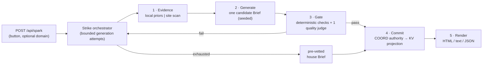

# Architecture Spine — Oddspark Opportunity Brief Pipeline

## 2026-08-24 Simplification Override

This decision supersedes every active three-specialist, twelve-call, specialist-qualification, and composite-specialist-authority rule elsewhere in this document. Those passages remain historical context only.

The active Candidate path is intentionally direct:

1. Generate one Candidate.
2. Run the existing deterministic schema, linkage, privacy, grounding, reference, and prohibited-token checks.
3. If those pass, invoke one candidate-bound lightweight quality judge exactly once.
4. Save/show the Candidate only when the deterministic checks and judge pass; otherwise use the reviewed house fallback.

Cached or already saved Sparks and house fallbacks are never judged again. There is no coherence/fit/quality waterfall, judge retry, specialist qualification system, or twelve-call/four-slot reservation system. The existing broad `CanonicalVerdict` contract is retained as the single lightweight judge port until a later deliberately scoped replacement is approved. Normal fail-closed result validation, provider-error handling, timeout handling, and model-call accounting remain required.

## Design Paradigm

**Pipes-and-filters, single orchestrator.** The generator is a pipeline of typed, runtime-neutral ES-module stages assembled behind the single public Worker entrypoint. Stages are single-pass: each consumes only the previous stage's output and returns a typed value. The retry loop lives in exactly one place — the strike orchestrator at the existing `buildSpark` / `buildDomainSpark` call sites.



`Evidence` never calls `Gate`; `Generate` never sees the judge's verdict except as a retry signal from the orchestrator; `Render` never sees free model text. The seed feeds (drand/NOAA) enter at `Generate`; the window pin enters at `Commit`.

## Shared Port Contracts

- `EvidenceContext {attempt_id,evidence,rubric_version}` is the immutable output of Evidence. `Generate` adds only `candidate` and its derived `candidate_ref`. Local Gate then derives and freezes `grounding_report`, producing the complete `AttemptContext {attempt_id,candidate,evidence,grounding_report,rubric_version,candidate_ref}` passed to the judge. No stage receives Gate inputs through closure or mutable shared state.
- `candidate_ref` is `sha256("oddspark-candidate-ref/v1\n" + canonical_json({candidate_schema_version,candidate}))`. Canonical JSON recursively sorts object keys and preserves array order. The provider must echo the exact reference; an adapter may not synthesize or repair it.
- `Evidence` is the closed tagged union defined in AD-4. `GroundingReport` is `{version:int,evidence_ref:string,entries:[{claim_ref:string,source_url:string,source_text:string,exact_match:boolean,pii_status:"pass"|"fail"|"unknown",number_status:"pass"|"fail"|"not_applicable",reason:string}],pass:boolean}` with no unknown fields. `evidence_ref` hashes the canonical Evidence Bundle with a versioned domain separator; every business-specific claim, Breadcrumb, and grounded number has exactly one passing entry. Story 1.7 owns the production validator and fixture detail without changing this port.
- The active semantic port is up to three closed `SpecialistResult` values as defined by AD-2 plus one deterministic `GateDecision {candidate_ref,deterministic_checks:[{check_id,outcome,failure_code}],specialists:{coherence:SpecialistInvocation,fit:SpecialistInvocation,quality:SpecialistInvocation},terminal_stage:"deterministic"|"coherence"|"fit"|"quality"|"aggregate",pass:boolean}`, where `SpecialistInvocation {state:"not_invoked"|"result"|"failed",result_ref:string|null,failure_code:string|null}`. `result` requires exact non-null result ref and null failure; `failed` requires null result and a stable provider/timeout/transport/adapter/contract failure code; `not_invoked` requires both null and is valid only after an earlier terminal stage. `pass:true` requires all three `result` states whose checks pass and `terminal_stage:"aggregate"`; any other state requires `pass:false`. Historical `CanonicalVerdict`/`JudgeResult` bytes remain immutable evidence for Stories 1.3–1.18.1 but are not an active runtime, qualification, or activation port.
- A committed value is `CommittedBrief {artifact_version, id, request_scope, brief, brief_schema_version, policy_identity, rubric_identity, provenance}`. Readers accept only explicitly supported versions; a supported legacy shim may map losslessly, otherwise the read is a cache miss and the request follows the normal coordinator/house-Brief path. Older code never reinterprets, silently overwrites, or renders a newer artifact.

## Invariants & Rules

### AD-1 — Gates are a pipeline stage, not a filter

- **Binds:** CAP-3, FR-3, FR-4
- **Prevents:** coherence checks decaying into post-hoc style nudges or being bypassed on the happy path
- **Rule:** every rendered Brief is the output of the `Gate` stage (or the pre-vetted house Brief). No code path from `Generate` to `Render` skips `Gate`.

### AD-2 — Gate combines deterministic validation with isolated semantic specialists

- **Binds:** CAP-3, FR-3
- **Prevents:** the generator grading its own homework; one broad model impression compensating across checks; provider wire shape becoming the internal contract; semantic repair or model-authored aggregation inventing a pass
- **Rule:** `Gate` first deterministically validates Brief/Evidence schemas, mode and `candidate_ref` linkage, Breadcrumb cardinality, exact grounding, mechanically decidable PII, grounded-number provenance, Story 1.7's non-model personal-name policy, required preservation-field presence, exact declared capability/channel references, and banned phrases. Any `fail` or `unknown` rejects without a judge call. A survivor enters a fixed sequential waterfall of independently qualified specialists: **coherence** owns Gates 1, 2, and 8; **fit** owns Gates 3, 4, 5, and 6; **quality** owns Gate 7, Gate 9, non-token tone, qualitative unsupported claims, and invitation pressure. Each receives only immutable Candidate/Evidence facts, grounding report, its rubric slice/version, and `candidate_ref`; it may report only its assigned checks. The closed `SpecialistResult {candidate_ref,specialist,checks:[{check_id,outcome:"pass"|"reject"|"unknown",candidate_paths:string[],evidence_paths:string[],grounding_paths:string[],reason:string}]}` requires every assigned check exactly once, no unassigned check, non-empty reasons, and valid cited support. Missing/invalid pointers, ambiguity, contradiction, `unknown`, schema drift, binding mismatch, provider failure, or timeout rejects. Coherence runs first, then fit, then quality; the first non-pass stops the waterfall and releases only uninvoked reservations. Models emit no overall verdict. Deterministic code alone passes the Candidate when every deterministic and specialist check passes. A frozen adapter may remove only validated wrapper metadata and map the inner result losslessly; it never repairs, coerces, fills omissions, or chooses among values. Detailed findings remain internal and never render to visitors.
- **Closed ownership:** `SpecialistOwnershipManifest {version,checks:[{check_id,owner:"deterministic"|"coherence"|"fit"|"quality",phase:int,allowed_candidate_pointer_prefixes:string[],allowed_evidence_pointer_prefixes:string[],allowed_grounding_pointer_prefixes:string[],failure_code:string}]}` lists every rubric/policy check exactly once in canonical execution order; omission, duplicate/multiple ownership, unknown check, or output by a non-owner rejects. `ownership_ref = sha256("oddspark-specialist-ownership/v1\n" + canonical_json(manifest))` is part of every specialist structural identity and both composite refs.
- **Pointer evidence:** every path is canonical RFC 6901 relative to its named immutable root (`candidate`, `evidence`, or `grounding_report`): it starts with `/`, forbids URI-fragment form and the empty root, uses only canonical `~0`/`~1` escaping, uses `0` or non-zero decimal array indexes without leading zeros, resolves, and is unique after decoded-token normalization. Prefix allowlists compare decoded token sequences, never raw string prefixes. A valid target is a non-empty string, any finite number or boolean, or a non-empty array/object; null, empty string, and empty container reject. Each check has at least one path across the three arrays and all paths match its owner/check allowlists. For absence-based passes, the specialist cites every complete Candidate field enumerated by that check's allowlist and explains the absence; empty support or whole-root citation rejects. Semantic relevance remains frozen prompt/expectation authority; adapters validate structure and ownership but never invent relevance.

### AD-3 — Bounded attempts, pre-vetted fallback

- **Binds:** CAP-3, FR-4; cost NFR
- **Prevents:** unbounded LLM spend per button press; near-miss ideas shipping under pressure
- **Rule:** the orchestrator starts only complete generation-plus-three-specialist attempts within AD-9's twelve-call ledger. The Candidate ceiling remains 3 for `E=0` and 2 for `E=1`; a new Candidate starts only when four model-call slots and the complete declared time budget fit. Local rejection releases all three uninvoked specialist reservations; coherence or fit rejection releases only later uninvoked reservations. Invoked calls remain consumed. On exhaustion, insufficient remaining deadline, or any grounding/infra failure that invalidates a Candidate, serve the house Brief: a curated, per-season Coherent Local Mode Brief stored in code, gate-passing by construction and reviewed against the voice rubric before launch.

### AD-4 — Evidence boundary with single-owner grounding

- **Binds:** CAP-2, FR-2, FR-8, FR-9; privacy guardrail
- **Prevents:** business-specific "facts" smuggled in from model pretraining; breadcrumb PII leaks; audit creep; two stages disagreeing about what "grounded" means
- **Rule:** Website-Grounded Evidence is exactly `{version:int,mode:"domain",vertical:string,clarity:"clear"|"unclear",capabilities:string[],channels:string[],observation:{source_id:string,url:string,text:string},scanned_urls:string[]}`. Coherent Local Evidence is exactly `{version:int,mode:"local",priors:{region:string,season:string,date:string,situation:string,capability_bundle:string[]}}`. All fields are required and unknown fields reject. A submitted public response may contain PII only in the ephemeral scan buffer; detected PII is discarded before evidence persistence or model input. After Generate, Local Gate derives grounding once against scan text canonicalized through the existing `normalizeSpace`/`observationSpan` helpers — never re-verified by the judge against raw HTML. Every business-specific claim and grounded number must trace to the bundle; every quoted Breadcrumb must be an exact substring of canonical text and pass mechanically decidable PII checks plus Story 1.7's pure, Node-importable personal-name policy. That policy returns `pass|fail|unknown`, records a stable reason in the grounding report, consumes no model call, and rejects on `fail` or `unknown`. A grounding/privacy failure rejects the Candidate (orchestrator retries per AD-3) — it never silently downgrades mode and the semantic judge cannot override it. Mode downgrade happens only at the evidence threshold (`clarity=clear` ∧ ≥1 verified observation ∧ non-empty `capabilities[]`), evaluated before generation, falling back to Coherent Local Mode with the plain-language notice. Scanning respects robots.txt. The bundle replaces `hashProfile`'s preimage; `profile_hash` is recomputed over the new bundle shape with a version bump. [ADOPTED: threshold from user-reviewed PRD OQ5.]

### AD-5 — Brief is a typed schema; claim discipline is structural

- **Binds:** CAP-4, FR-5, FR-6, FR-7
- **Prevents:** renderers consuming free text; fabricated numbers; audit-list drift; CTA pitch drift; Generate and Render diverging on field shape
- **Rule:** a Brief is one JSON object, all string fields plain text unless noted:
  ```
  {version: int, mode: "local"|"domain",
   title: string, plan: string,
   why_fits: {text: string, breadcrumb?: string},
   what_gets_better: string,
   before_after: {before: string, after: string},
   change_level: {time_range: string, steps_changed: int, steps_removed: int, preliminary: true},
   stays_same: {tools: string[], authority: string[], steps: string[]},
   invitation: string,
   notice?: string,            // plain-language fallback notice (AD-4)
   grounded_numbers: string[]} // the only numeric strings allowed outside change_level,
                               // each locally provenance-verified as site-supplied
  ```
  `version` is an integer bumped on any shape change (matching the `PERSONALIZATION_VERSION` precedent). `mode` is the single authority renderers branch on — the legacy `personalization.status` branching is removed. All renderers (HTML, `asText`, `/api/spark/:id`) consume this schema — never raw model output.

### AD-6 — Preservation seam at the generation port

- **Binds:** FR-10, FR-11; all preserved shell behavior
- **Prevents:** the pipeline rewrite entangling router, KV, DOs, page shell, or seed feeds
- **Rule:** the pipeline replaces only the internals of `generate` / `generatePersonalized` behind their existing call sites. Shell → pipeline dependency only; the pipeline never calls back into router, page, or render code. Router, KV key scheme, seed feeds, scan budgets, and the page shell remain preserved except for five closed architecture-authorized seams: AD-4 (`profile_hash` preimage), AD-7 (coordinator receipt/read/commit and id validation), AD-8 (atomic aggregate metrics), AD-10 (`POST /api/cheer`), and AD-12 (strike/result representations). AD-12 authorizes exactly the governing UX record's D1, D1a, D2, D2a, and D3–D24 rows—no more. It does not authorize new generation inputs, routes beyond `/api/cheer`, cache identities, persistence, client product state, analytics, provider activity, or cross-repository work. Any new, renumbered, or materially changed UX delta requires architecture reconciliation.

### AD-7 — Cache-first commit preserves the receipt

- **Binds:** FR-11, OQ1 (resolved)
- **Prevents:** LLM nondeterminism breaking same-window reproducibility; two visitors in one window seeing different sparks
- **Rule:** the first gate-passing Brief in a seed window (or per `(round, domain)` claim — including the house Brief, which commits like any other artifact) is committed authoritatively through COORD claim/commit. The coordinator receipt contains the complete `CommittedBrief`; `w:` / `pw:` remain best-effort read projections. On a missing or stale KV pin, readers consult COORD before generating, so same-window identity depends on the coordinator rather than KV propagation. Concurrent strikes converge on one committed receipt. The system claims *committed-artifact reproducibility*, never model determinism. Request scope owns the cache key: a domain request that downgrades to a local Brief remains under its `pw:`/domain claim and never populates global `w:`. Effective mode owns presentation; request scope constrains permalink eligibility. Local public artifacts and their authoritative receipts expire exactly 30 days after commit, approved by Justin on 2026-08-17; `/s/:id` returns not found at or after that boundary. Domain-scoped artifacts are internal-cache only: `/s/:id` always refuses them, while `/api/spark/:id` may return them only during the first hour after authoritative commit. The domain-result TTL is exactly one hour, approved by Justin on 2026-08-17 and implemented by Story 2.6; expiry applies consistently to the coordinator receipt, `pw:` projection, and API eligibility. **Carve-out to AD-6:** SparkCoordinator claim/read/commit validation and `SPARK_ID_RE` are amended to accept, store, and return the versioned Brief artifact; metrics add the narrow AD-8 coordinator operation. UI copy keeps the PRD FR-11 interim stance: no reproducibility promise is added until cache-first behavior is verified in production.

### AD-8 — Server-side aggregate analytics only

- **Binds:** SM-1 and aggregate operational measurement; privacy guardrail; OQ4 (resolved). SM-2 remains sampled Brief review; SM-3 remains separately attributed inbound-conversation review.
- **Prevents:** analytics reintroducing per-visitor tracking through the back door
- **Rule:** aggregate counters are atomically owned by a narrow COORD `/metric` operation: `briefs_served` increments only after an authoritative committed/house receipt is successfully resolved for rendering; `house_briefs_served` is its house-Brief subset; `invitation_acted` records an accepted `POST /api/cheer`. A `400`, `404`, or `502` response increments none of these served-outcome counters. SM-1 is the approximate aggregate event rate `invitation_acted / briefs_served`; it is intentionally not deduplicated per visitor or render, may be skewed by repeat actions, and must never be presented as a true people/render percentage. Reports disclose receiver-activation coverage for the interval because plain-link fallback actions intentionally emit no event; this is release-state metadata, not another visitor counter. The launch fallback gate is the served-event ratio `house_briefs_served / briefs_served`, measured from authoritative COORD totals over at least 100 production serve events; public launch requires the exact integer comparison `house_briefs_served * 100 < briefs_served * 10` (strictly below 10%), approved by Justin on 2026-08-17. Slow accumulation is a schedule observation: the sample remains incomplete and cannot be manufactured or weakened. The separate same-interval availability record retains only aggregate response-class totals, interval/coverage metadata, deployed identity, and hashes of the platform query/configuration; raw logs, IPs, URLs, query strings, submitted domains, and artifact ids never enter repository evidence. `m:<day>:*` KV values are report/read snapshots only, never the increment authority. No per-visitor analytics keys are introduced beyond the existing abuse carve-out (hashed-IP slot window, profile cache).

### AD-9 — All model spend shares one twelve-call ledger and hard deadline

- **Binds:** cost NFR; AD-3
- **Prevents:** the gate stage silently multiplying per-press cost; a strike hanging
- **Rule:** the deadline starts at route entry and covers evidence, every model call, gating, and coordinator commit. Evidence freezes `E` before Candidate attempts begin. Before an attempt, the orchestrator atomically reserves one generation slot and three specialist slots; each slot is consumed immediately before its invocation. Deterministic or earlier-specialist rejection releases only never-invoked downstream slots; errors, invalid output, and timeouts remain consumed. No attempt starts when all four slots or declared timeouts plus commit reserve cannot fit. Every call uses its AD-11 selector and the common twelve-call ledger/deadline. Specialist fallback selection occurs only before invocation from current availability/circuit state; once invoked, the same Candidate is never re-judged and no fourth semantic call exists. For Workers AI, `NeuronMeter` remains best-effort and fail-open by established convention: authorization/meter failure increments an anomaly but creates no additional ledger capacity. Another provider needs a separately approved cost-control convention before qualification. Story 1.19 measures the complete waterfall and establishes a hard, owner-approved route ceiling; the prior provisional 15-second number is not activation authority. Unknown, unavailable, unqualified, over-budget, or over-deadline configurations serve the house Brief.
- **Selection snapshot:** before coherence, freeze one closed `CandidateJudgeSelection {version,candidate_ref,availability_snapshot_ref,selection_policy_ref,coherence_config_ref,fit_config_ref,quality_config_ref,selected_at}` containing all three choices. Its closed `AvailabilitySnapshot {version,captured_at,expires_at,clock:"system_utc",source_ref,members:[{specialist:"coherence"|"fit"|"quality",primary_state:"available"|"circuit_open"|"unavailable",fallback_state:"available"|"circuit_open"|"unavailable"}]}` uses canonical specialist order and hashes as `availability_snapshot_ref = sha256("oddspark-specialist-availability/v1\n" + canonical_json(snapshot))`. `source_ref` binds canonical selector/circuit-store state bytes and deployed selector identity. Selection requires `captured_at <= selected_at < expires_at`, exact current source/selection-policy refs, primary when qualified+available else qualified+available fallback, and rejects any missing/extra/duplicate state or unavailable pair before the first specialist call. Half-open is never selectable. No choice or snapshot changes during that Candidate.
- **Ledger and deadline:** the request starts with twelve capacity tokens. Evidence invocation, when used, consumes one through the same durable reservation/invocation rule before Candidate admission. Each attempt atomically exchanges four tokens for immutable slot records; each transitions only `reserved -> invoked` or `reserved -> released`. One idempotent release creates exactly one new token id; records are never reused. Invocation wins abort/timeout races after durable transition. Attempt admission requires four tokens and `deadline_remaining >= selection_reserve + generation_timeout + deterministic_precheck_reserve + coherence_timeout + fit_timeout + quality_timeout + aggregation_reserve + commit_reserve`; these reserves cover mandatory non-model work and short-circuit never retroactively admits an ineligible attempt. The closed `DeadlineAuthorityManifest {version,route_ceiling_ms,selection_reserve_ms,generation_timeout_ms,deterministic_precheck_reserve_ms,coherence_timeout_ms,fit_timeout_ms,quality_timeout_ms,aggregation_reserve_ms,commit_reserve_ms,measurement_ref,approved_by,approved_at,outcome:"approved"}` requires positive finite integers whose total does not exceed the ceiling and hashes as `deadline_ref = sha256("oddspark-deadline-authority/v1\n" + canonical_json(manifest))`. Applicable local/domain full-waterfall authority binds this exact ref; missing/mismatch disables that mode's model-backed writes.

### AD-10 — Interaction contract unchanged

- **Binds:** FR-10
- **Prevents:** pipeline complexity leaking into the UI
- **Rule:** one button, one optional domain field. Mode selection is implicit in domain presence. The only new endpoint is `/api/cheer` (AD-8); no new generation inputs, fields, or client state. The receiver identity is the closed `HearnReceiverManifest {version:int,contract_version:int,origin:"https://hearn.systems",path:"/contact",query_keys:["source","spark"],deployed_revision:string,verified_at:string,outcome:"pass"}` with no unknown fields, and `receiver_ref = sha256("oddspark-hearn-receiver/v1\n" + canonical_json(HearnReceiverManifest))`. With an exact matching active receiver ref, an accepted invitation POST atomically records `invitation_acted` and returns a fixed `303` to `https://hearn.systems/contact?source=oddspark&spark=<encoded-id>`. The destination is allowlisted, never request-controlled, and carries only the opaque artifact id—no domain, Brief text, title, seed, Evidence, or visitor data. Before the action, adjacent fixed plain-language copy states that local references expire 30 days after creation and website/domain references expire one hour after creation; no countdown state is introduced. Hearn's contact form must visibly preserve that reference in its submission before activation; this cross-repository change requires separate authority. The reference identifies an exact committed artifact, and neither system promises later content availability. A change to the shared contract version, receiver deployment, approved origin/path/query keys, or reference-preservation behavior makes receiver proof stale and requires separately authorized Hearn re-verification. If the manifest/ref is malformed, unknown, stale, failed, mismatched, or withdrawn, the renderer uses the fixed plain Hearn contact link, does not POST `/api/cheer`, and records no `invitation_acted` event. Domain content remains subject to the one-hour Oddspark read boundary and is never copied into the contact URL or a new persistence path.

### AD-11 — Evidence, generation, and judge roles qualify independently

- **Binds:** FR-2, FR-3, FR-4; AD-2, AD-3, AD-9; Stories 1.4, 1.11, 1.18, 1.18.1, 1.18.2, 1.19, 2.3, 2.8
- **Prevents:** an unproven model reaching production; primary/fallback rates being pooled; Story 1.18 becoming an unbounded provider bakeoff
- **Rule:** generation, evidence, and each semantic specialist use separate role configurations even when they share a provider/model. A structural identity freezes provider, resolved model, request parameters, specialist prompt-template hash, provider-wire-schema hash, adapter hash, candidate-binding and specialist-contract versions, runtime/version, and timeout/call-policy hash. The complete check-scoped instruction, pointer/reason requirements, uncertainty policy, and absence of model-authored overall verdict are normative prompt content; changing any constituent makes its role ref and the composite judge/semantic/downstream refs stale. A semantic identity versions the unchanged rubric and golden/anti-golden corpus. The existing closed `QualificationManifest` and hash construction remain the per-configuration authority. Before any live qualification, Story 1.2 freezes the exact runtime inputs; later drift invalidates affected evidence transitively. Marker-bound zero-call preflight, consumed-incomplete accounting, immutable history, independent role allowances, no pooling, no result-driven retry, and fresh exact-plan approval rules remain unchanged. Story 1.18 and the failed Story 1.18.1 prompt-only recovery remain retained `NO-GO` history. Justin's 2026-08-24 architecture review authorizes offline planning and implementation of Story 1.18.2's three-specialist pipeline only; it authorizes no provider call, model/provider substitution, deployment, or activation. Story 1.19 completes live full-waterfall latency/cost evidence only after current structural and semantic GO refs exist. Production requires every applicable stage current.
- **Cycle accounting:** prior broad-judge matrices are immutable history and never satisfy specialist refs. Coherence, fit, and quality each have one separately consumed structural cycle with exact plan/caps/approval/evidence/marker/terminal state. Batch approval is allowed, but first call consumes only that allowance. `consumed_incomplete`, ambiguous accounting, or missing terminal publication explicitly forbids both configuration refs and the entire `SpecialistRoleQualificationSet` for that specialist even if its peer configuration previously passed; completed other specialists remain immutable evidence. No retry, transfer, substitution, resume, or borrowing exists. Composite `judge_ref` requires all three current GO role refs from the same frozen source/runtime identity; drift prevents composition.
- **Specialist qualification and pipeline set:** coherence, fit, and quality each have a distinct prompt/contract structural identity. The closed `SpecialistRoleQualificationSet {version,specialist,primary:{resolved_model,qualification_ref:string|null,outcome:"go"|"no-go"},fallback:{resolved_model,qualification_ref:string|null,outcome:"go"|"no-go"},ownership_ref,contract_ref,tested_source_identity,cycle_ref,outcome:"go"|"no-go"}` uses canonical primary/fallback order; each selectable GO member requires its exact current configuration ref, each NO-GO member requires null, and role outcome is GO iff at least one member is GO. `specialist_role_ref = sha256("oddspark-specialist-role-qualification/v1\n" + canonical_json(set))`. Rates and trials never pool. Structural qualification exercises each specialist independently and its public validator proves binding, exact assigned checks, pointer grammar/allowlists, absence of an overall verdict, and direct-valid thresholds before a role ref exists.
- **Expectation authority:** the closed `SpecialistExpectationManifest {version,semantic_identity_sha256,ownership_ref,fixtures:[{fixture_id,terminal_stage:"deterministic"|"coherence"|"fit"|"quality"|"aggregate",deterministic:[Expectation],coherence:[Expectation],fit:[Expectation],quality:[Expectation]}]}`, with `Expectation {check_id,expected_outcome:"pass"|"reject"|"unknown"|"not_applicable",failure_code:string|null}`, contains every fixture once. Each named array contains every check owned by that stage exactly once and no foreign check; thus applicability is a property of an owned fixture/check pair, not a cross-owner duplicate. `not_applicable` is manifest-only, requires null failure, and never appears in model output. Missing, extra, duplicate, or unknown mappings reject. `expectation_ref = sha256("oddspark-specialist-expectations/v1\n" + canonical_json(manifest))`. Qualification runs every non-`not_applicable` pair despite production short-circuiting and matches outcome plus terminal owner/failure-code boundary with zero mismatches.
- **Composite authority:** the closed `JudgePipelineQualificationSet {version,coherence_role_ref,fit_role_ref,quality_role_ref,ownership_ref,deterministic_precheck_ref,aggregator_ref,selection_policy_ref,tested_source_identity,outcome:"go"}` exists only when all three current structural specialist role sets and deterministic constituents are GO/current; `judge_ref = sha256("oddspark-judge-pipeline-qualification/v1\n" + canonical_json(set))`. Semantic results remain configuration-specific. Each closed `SpecialistSemanticQualificationSet {version,specialist,structural_role_ref,expectation_ref,primary:SemanticMember,fallback:SemanticMember,trial_accounting_ref,tested_source_identity,outcome:"go"|"no-go"}` uses canonical primary/fallback order, where `SemanticMember {configuration_ref:string|null,report_ref:string|null,structural_outcome:"go"|"no-go",semantic_outcome:"go"|"no-go"|"not_tested"}`. Structural NO-GO requires null refs and `not_tested`; structural GO requires non-null refs and semantic GO/NO-GO; semantic GO requires exact zero mismatch. Any consumed-incomplete or ambiguous member prevents the set from being emitted at all and blocks that specialist regardless of its peer. Otherwise role outcome is GO iff at least one member is semantic GO. `specialist_semantic_ref = sha256("oddspark-specialist-semantic-qualification/v1\n" + canonical_json(set))`. `SpecialistTrialAccountingManifest {version,specialist,configuration_records:[{configuration_ref,scheduled,started,completed,report_ref}],total_started,total_completed,completion_marker_ref}` hashes to the exact `trial_accounting_ref` and rejects cardinality/publication ambiguity. The closed `PipelineSemanticQualificationManifest {version,judge_ref,semantic_identity_sha256,expectation_ref,deterministic_report_ref,coherence_semantic_ref,fit_semantic_ref,quality_semantic_ref,trial_accounting_refs:{coherence,fit,quality},tested_source_identity,outcome:"go"}` requires all three specialist semantic sets GO/current and exact source/expectation/accounting linkage; `semantic_ref = sha256("oddspark-pipeline-semantic-qualification/v1\n" + canonical_json(manifest))`. Runtime selection may choose only a member GO in both structural and semantic sets. Missing/extra/duplicate/stale reports reject.
- **Atomic activation:** the sole activation input is the closed `ProductionActivationManifest {version:int,deployed_source_identity:string,generation_ref:string,judge_ref:string,semantic_ref:string,local:{enabled:boolean,full_request_ref:string|null},domain:{enabled:boolean,evidence_ref:string|null,full_request_ref:string|null},house_catalog_ref:string,receiver_ref:string|null,receipt_claim_ref:string|null,outcome:"active"}`. At least one mode is enabled; local enabled requires non-null local full-waterfall ref and disabled requires null; domain enabled requires non-null Evidence and domain full-waterfall refs and disabled requires both null. Shared generation/judge/semantic/catalog refs are always non-null/current; receiver and receipt-claim retain their separately governed nullable contracts. `activation_ref = sha256("oddspark-production-activation/v1\n" + canonical_json(manifest))`. Applicable full-waterfall records carry exact `deadline_ref`. The immutable store publishes a closed `ActivationPublicationBundle {version,manifest_ref,records:[ActivationRecord],outcome:"complete"}`, where `ActivationRecord {kind,ref,sha256}` and `kind` is exactly one of `activation_manifest|source_identity|runtime_identity|generation_role|specialist_configuration|specialist_structural_role|judge_pipeline|ownership|deterministic_precheck|aggregator|selection_policy|expectation|qualification_report|trial_accounting|specialist_semantic|pipeline_semantic|full_waterfall|deadline|evidence_role|house_catalog|receiver|receipt_claim`. `manifest_ref` equals `activation_ref`; records sort by `(kind,ref)`, contain the manifest plus exact recursive transitive closure once, and reject omissions, extras, duplicates, cycles, unknown kinds, or hash/ref mismatch. `publication_ref = sha256("oddspark-activation-publication/v1\n" + canonical_json(bundle))`; marker `{version,publication_ref,bundle_sha256,published_at}` hashes as `completion_marker_ref = sha256("oddspark-activation-complete/v1\n" + canonical_json(marker))`. Publication is invisible until marker and exact bundle bytes are durably linked. Runtime validates one marker-bound snapshot atomically before exposing bindings. Shared authority failure disables both modes; local full-waterfall failure disables local only; domain Evidence/full-waterfall failure disables domain only. No partial specialist activation exists.
- **Release decision:** the deterministic closed release-decision view is derived on demand from the deployed source identity, activation ref, and every applicable existing evidence and approval gate. It represents each gate as `pass|blocked|stale|unapproved` with an exact evidence ref or stable reason code; omission rejects and overall readiness requires every applicable gate to pass. It creates no new authority, persistence path, KV key, COORD record, or approval record. Deployment, quiet-production observation, public promotion, receipt-claim activation, and destructive legacy retirement remain separate owner decisions whose authority never transfers implicitly.
- **Receipt-claim gate:** the closed `ReceiptClaimManifest {version:int,production_verification_ref:string,deployed_source_identity:string,copy_sha256:string,approved_by:string,approved_at:string,outcome:"active"}` has no unknown fields and hashes as `receipt_claim_ref = sha256("oddspark-receipt-claim/v1\n" + canonical_json(ReceiptClaimManifest))`. Stronger receipt/reproducibility copy renders only when the single production activation manifest contains that exact current ref and its deployed identity and approved copy hash match runtime; otherwise non-claiming copy renders.
- **Evidence-role extension:** model-assisted domain Evidence uses a third, independently qualified `EvidenceProvider`, never a borrowed generation or specialist qualification. Story 2.3 freezes and qualifies its primary/fallback configurations against the exact closed AD-4 domain Evidence shape; each configuration must independently meet its direct-valid threshold and isolated latency/cost allocation. One invoked Evidence call consumes `E=1`, leaving at most two complete four-slot Candidate attempts. The domain section of the production activation manifest additionally names the exact Evidence structural ref and domain full-request evidence. Story 2.8 verifies the domain request including Evidence; Story 1.19's full-request evidence remains the local `E=0` path. An Evidence-role `NO-GO` blocks domain model inference and triggers architecture review without consuming specialist qualification authority.

### AD-12 — The strike transport has one outcome and two representations

- **Binds:** FR-4, FR-10, FR-11; UX-DR2–UX-DR5; D1, D1a, D2, D2a, D5, D14, D15
- **Prevents:** progressive enhancement creating a second generation path; representation choice changing terminal precedence, cache identity, permalink privacy, or aggregate metrics
- **Rule:** `POST /api/spark` invokes one validation, pipeline, authoritative commit, and outcome contract. Representation is selected only at the transport boundary:
  1. Explicit `Accept: application/json` wins, even with a form-encoded body.
  2. Otherwise, a request accepting HTML or carrying a browser-form content type receives shell HTML.
  3. Remaining requests preserve existing JSON behavior.
  Responses emit the selected `Content-Type`; the existing `Vary` value retains `Origin` and adds `Accept` and `Content-Type`.
- **Successful delivery:**
  - JSON success returns `200` with the committed artifact. An enhanced local response may apply `history.replaceState` to `/s/:id`; that client-only history mutation performs no request, generation, persistence, or metric increment. Domain-scoped results, including local-mode downgrades, never change the URL.
  - HTML success under local request scope returns `303 /s/:id` after authoritative commit. The redirect renders and counts nothing; the followed eligible `GET /s/:id` re-reads the AD-7 artifact, server-renders the shell, and increments the served metric once. Refresh repeats that GET and never re-strikes.
  - HTML success under domain request scope, including a local-mode downgrade, returns direct `200` home-shell HTML from `POST /api/spark`. The browser URL therefore remains `/api/spark`; no redirect, permalink, or history mutation occurs, and the served metric increments once. A browser refresh may re-submit, but every submission follows the same authoritative domain claim/read path.
  Redirect and permalink eligibility branch on request scope and AD-7 eligibility, not rendered `Brief.mode`.
- **Terminal delivery:** invalid input remains `400`; JSON returns stable `{error,field}`, while HTML returns the UX-governed shell. No strike starts and no served metric increments. COORD or required-infrastructure uncertainty remains `502`; JSON or shell HTML is selected by the same negotiation rule, no artifact renders, and no served metric increments. Unknown, expired, unsupported, or domain-scoped `/s/:id` returns the UX-governed `404` shell without generation or a served metric. Enhanced in-place `400`/`502`/not-found handling follows the governing UX focus rules; a fresh full-document HTML `400`/`502`/`404` response sets no scripted focus.
- **Caching and authority:** dynamic strike, redirect, JSON/HTML result, error, and permalink responses use `Cache-Control: no-store`. COORD remains authority; KV remains a projection; HTTP caches never become artifact authority. An unsupported projection encountered during strike resolution follows AD-7's compatibility/cache-miss rule and is never rendered or silently overwritten.
- **Metric point:** `briefs_served` increments exactly once at successful artifact delivery: the JSON `200`, the domain-scope HTML `200`, or the followed local permalink `GET`—never the local `303` or `history.replaceState`. `house_briefs_served` increments at the same delivery point for a house Brief. Each later successful refresh is a separate, intentionally non-deduplicated serve event; `400`, `404`, and `502` increment neither counter.

### AD-13 — One runtime-neutral pipeline source is assembled before deployment

- **Binds:** AD-1–AD-9, AD-11–AD-12; Stories 1.16 and 1.23–1.26
- **Prevents:** Node-only proof modules diverging from the Worker writer; a substitute Brief being invented at the route boundary; implementation, deployment, and activation authority collapsing into one event
- **Rule:** Evidence, generation, Local Gate, semantic-judge adaptation, strike orchestration, committed-receipt handling, and Brief projection have one canonical runtime-neutral ES-module implementation under `src/pipeline/`. `src/worker.js` imports and assembles those modules behind the existing request boundary, and Node verification imports those same modules. Files under `scripts/` may remain test, qualification, or CLI adapters, but may not contain a second production writer or independently reimplement a closed validator, canonical hash, grounding rule, ledger transition, receipt rule, or projection.
- **Assembly authority:** offline tests may assemble the Worker with injected fake providers, coordinator, clock, storage, and activation ports. This creates no production binding, provider-call, deployment, or activation authority. Model-backed writes remain unreachable until the single current `ProductionActivationManifest` authorizes them.
- **Inactive-domain path:** Story 1.16 derives one closed domain-scope/local-mode dispatch value and never constructs a Brief. Story 1.23 assembles and proves the canonical cold writer offline. During the Story 1.26 local-only activation phase, that writer handles a valid domain request under domain request scope with effective local mode and the fixed notice. No scanner or EvidenceProvider runs, no global `w:` projection is populated, no domain permalink is minted, and no legacy or substitute writer is available.

## Consistency Conventions

| Concern | Convention |
| --- | --- |
| Layout | `src/worker.js` remains the single public Worker entrypoint and route shell. Canonical runtime-neutral pipeline modules live under `src/pipeline/` and are bundled through ordinary local ES-module imports; banner boundaries remain explicit at the entrypoint assembly seam. Constants are hoisted; tunables are consts; model IDs are Wrangler vars. [ADOPTED] |
| Naming | KV keys keep prefix namespacing (`w:`, `pw:`, `profile:`, `n:`, new `m:`); persisted artifacts carry integer `version` + provenance; Brief ids stay `seed[0:8]` / `p-<hash[0:16]>`. [ADOPTED] |
| Data & formats | Failure outcomes follow the precedence table below; AD-12 selects JSON or shell HTML without changing the outcome. No path renders uncommitted generated output, raw model text, or the legacy seed. [ADOPTED] |
| State & mutation | All cross-request coordination via COORD transactions (claim/commit/profile/slot); DO access only through thin `coordPost`/`meterStub` helpers; side effects best-effort with justified try/catch. [ADOPTED] |
| Verification | Pipeline stages and the Brief schema stay Node-importable pure functions. Deterministic transport and UX fixtures remain offline. Current judge proof has four separate tiers: deterministic ownership/pointer/aggregator fixtures; independently approved structural qualification for coherence, fit, and quality; Story 1.18.2 exhaustive zero-mismatch combined semantic qualification; and Story 1.19 full-waterfall latency/cost/selection/ledger/deadline evidence. Stories 1.18/1.18.1 broad-judge results remain failed history only. Story 1.2 toolchain/runtime validation precedes live stages; later runtime-bound change invalidates affected evidence transitively. Exact identities bind every retained result; credentialed live tests require fresh approval and never run in CI. |
| Story status | A mixed story remains `in-progress` until all required slices pass. A completed `SAFE` slice is retained evidence, not authority to mark `review`/`done`; `NO-GO`, missing approval, and blocked release work remain explicit despite green offline tests. |
| Mode and cache | Clear domain evidence → domain Brief under domain request scope. Domain downgrade → local Brief plus notice, still under domain request scope. Local request → local Brief under global window scope. Exhaustion → house Brief under the original request scope. Request scope owns claim/cache identity and AD-12 redirect/permalink eligibility; effective mode owns rendering. Dynamic HTTP responses are `no-store`; COORD remains authority and KV remains a projection. |
| Terminal outcomes | The failure-precedence table below is authoritative over generic error/degradation wording elsewhere in this document; AD-12 changes representation, never status or precedence. |
| Development safety | Offline development is the default and has no callable AI binding. A separately invoked live-spike config may use a remote AI binding only with fresh approval; preview/live-spike resources must not bind production KV, DO, routes, assets, or persistent Worker names. |

### Failure precedence

| Condition | Outcome |
| --- | --- |
| Invalid request/domain input | `400`; JSON receives stable `error` and `field`, while any request for which AD-12 selects HTML receives the UX-governed shell HTML representation; no strike starts or served metric increments. |
| Website scan transport failure or insufficient evidence | Explicit local-mode downgrade with notice before generation; no partial domain Evidence Bundle. |
| Seed/feed failure after existing local feed fallbacks are exhausted | Authoritative committed Brief if present; otherwise validated house Brief, provided COORD remains reachable. |
| Candidate deterministic-precheck failure | Atomically release all three never-invoked specialist reservations; start only a wholly new Candidate when four slots and the complete AD-9 time budget fit. |
| Specialist rejection/unknown/invalid/provider failure | Consume the invoked specialist slot, atomically release only later never-invoked specialist slots, reject this Candidate, and start only a wholly new Candidate when four slots and the complete AD-9 time budget fit; never re-judge the same Candidate. |
| Missing/stale qualification, ledger exhaustion, or insufficient model deadline | Read authoritative committed Brief if present; otherwise commit/serve the validated house Brief. |
| COORD read, claim, or commit uncertainty | `502` in the AD-12-selected JSON or shell HTML representation; never render an uncommitted generated or house artifact or increment a served metric. |
| Unrelated required infrastructure failure | `502` in the AD-12-selected JSON or shell HTML representation with the stable error meaning; never substitute an unverifiable result or increment a served metric. |
| Unknown, expired, unsupported, or domain-scoped `/s/:id` | UX-governed `404` shell; no generation and no served metric. |

The house path is therefore graceful only while the authoritative coordinator can confirm or commit the receipt; coordinator uncertainty outranks degradation.

## Stack

| Name | Version |
| --- | --- |
| Cloudflare Workers (compatibility date) | 2026-07-01 (`global_fetch_strictly_public`) |
| Generation and specialist candidate — primary | `@cf/meta/llama-3.3-70b-instruct-fp8-fast`; generation and each of coherence/fit/quality qualify and select independently |
| Generation and specialist candidate — fallback | `@cf/meta/llama-3.1-8b-instruct-fast`; generation and each specialist qualify and select independently |
| Evidence-provider candidate pair | Unset until Story 2.3 freezes it and Justin separately approves the exact run plan |
| Production judge pipeline | Disabled until all three specialist structural roles, combined semantic authority, and full-waterfall evidence are current |
| Workers KV | `SPARKS` namespace (existing id) |
| Durable Objects (SQLite) | `NeuronMeter` (v1), `SparkCoordinator` (v2) |
| wrangler | 4.123.0 (reviewed runtime baseline; must be re-frozen before the new qualification cycle) |

## Structural Seed

```text
src/worker.js
  /* Feeds: drand + solar */            (unchanged)
  /* Seed derivation */                 (unchanged; axis lists deleted)
  /* Website input + scan */            (+ robots.txt check)
  /* Evidence assembly */               (extends inferWebsiteProfile → Evidence Bundle, both modes)
  /* Pipeline: generate */              (one candidate Brief, seeded, per mode)
  /* Pipeline: gate */                  (deterministic precheck + 3 SpecialistResult values + code-owned GateDecision)
  /* House Briefs */                    (curated per season, integer-versioned)
  /* Brief schema + grounding */        (AD-5 shape; AD-4 single-owner grounding)
  /* Strike orchestrator */             (retry loop, STRIKE_BUDGET_MS, house fallback)
  /* Spark assembly + commit */         (cache-first pins; Brief schema stored)
  /* Renderers: page / asText / json */ (consume Brief schema, branch on mode)
  /* Durable Objects */                 (AD-7 receipt/read/commit + AD-8 atomic metrics)
  /* Router */                          (/api/spark negotiation + server-rendered eligible local /s/:id + POST /api/cheer; domain-scope /s/:id refused)
src/pipeline/
  /* Canonical runtime-neutral stages */ (Evidence, Generate, Gate, strike, receipt, projection; imported by Worker and Node verification)
```

## Capability → Architecture Map

| Capability / Area | Lives in | Governed by |
| --- | --- | --- |
| CAP-1 Coherent Local Mode | Evidence (local priors) + Generate | AD-1, AD-3, AD-6 |
| CAP-2 Website-Grounded Mode | Evidence (scan bundle) + independently qualified EvidenceProvider + Generate | AD-4, AD-6, AD-11 |
| CAP-3 Coherence gating | Gate + independently qualified coherence/fit/quality specialists + deterministic aggregator + orchestrator + house Briefs | AD-1, AD-2, AD-3, AD-9, AD-11 |
| CAP-4 Result card + CTA | Brief schema + Renderers + `/api/cheer` | AD-5, AD-7, AD-8, AD-10, AD-12 |
| Progressive enhancement / representation parity | `/api/spark` negotiation + server page renderer + eligible local `/s/:id` | AD-6, AD-7, AD-12; governing UX D1, D1a, D2, D2a, D3–D24 |
| Receipt / verifiability (FR-11) | Commit stage + COORD receipt + KV projections | AD-7 |
| Privacy boundary | Evidence + schema grounding | AD-4, AD-8 |

## Deferred

- **Specialist prompts and semantic calibration** — Story 1.5's rubric/corpus remain frozen. Stories 1.18 and 1.18.1 are retained failed broad-judge history and cannot authorize runtime. Story 1.18.2 owns the three specialist contracts, independent structural qualification, exhaustive zero-mismatch semantic matrix, and composite pipeline authority.
- **Workers AI post-review qualification** — the gpt-oss generation and judge results remain `NO-GO`. The completed 2026-08-19 owner MVP review selected the AD-11 Llama primary/fallback pair because current Workers AI documentation lists both for JSON Mode while warning that schema compliance is not guaranteed. The runtime configuration still names the prior gpt-oss candidates until a separately reviewed offline adapter/config change binds the selected Llama IDs; architecture selection alone does not mutate configuration. Fresh generation and judge plans, cost caps, and execution approvals remain deferred to their governed story workflows. Any required-role `NO-GO` returns here for an explicit provider decision; it does not open another Workers AI model bakeoff.
- **Launch readiness gate** — the voice rubric + ≥3 golden Briefs per mode (PRD FR-5) must exist before the pipeline ships; judge calibration depends on them.
- **House Brief catalog** — content authored with the golden Briefs; spine fixes only that it exists, is versioned, and is gate-passing by construction.
- **`/how` page + mermaid update** — must be rewritten to the pipeline before launch; content decision, not structural.
- **Renderer layout for the 8-element card — resolved:** UX-DR1 governs the field-to-section mapping and renderer order within AD-5's schema and AD-6's closed shell-delta authority. This is an adopted implementation contract, not deferred design latitude.
- **KV TTL hygiene, CORS tightening, `/api/meter` exposure, wrangler compat-date bump** — pre-existing sharp edges; cleanup stories, not invariants.
- **Wrangler maintenance** — the reviewed runtime baseline is 4.123.0; the current release check found 4.124.0. An upgrade is a separate maintenance decision, but Story 1.2 must re-freeze the exact Wrangler version, compatibility date, generated bindings, and runtime configuration before either new live qualification matrix. A later runtime-bound change makes affected evidence stale transitively.

- **Operational envelope** — decided in fact: single existing production Worker on oddspark.dev, wrangler deploy, `[observability]` platform logs, no new environments. `preview_urls` is already top-level in the current configuration; no placement correction is pending. Offline development remains the default; the explicit live-spike config is the only approval-bound remote-AI path. Mixed-version rollout is reader-first: complete Story 1.2's reviewed toolchain/runtime baseline; establish authoritative COORD receipt/read and KV projections; complete Story 1.23's canonical Worker runtime assembly without deployment; deploy and verify the compatibility reader in Story 1.24; deploy the assembled compatible writer in Story 1.25's inactive safe posture without an active production manifest; and, under separate Story 1.26 activation authority, atomically publish the local-only manifest last. Story 1.19's live full-request evidence follows the authoritative commit path and remains separate from Worker assembly. After Story 1.26, two independent branches may complete in either order: Story 3.1 establishes the offline receipt harness, Story 3.2 performs local production proof, and Story 3.3 completes the first owner-review cycle from local production samples plus generated and house fixtures; independently, Stories 2.1–2.10 complete the domain path and atomically enable domain mode. Story 3.4 waits for both Story 3.3 and Story 2.10 before domain production proof. Neither prerequisite depends on or grants authority to the other. Later weekly SM-2 / SM-3 review follows `owner-review-runbook.md` and is not a sprint story. An explicitly approved Story 3.5 quiet-production checkpoint then gathers the organic served-event sample without promotion or synthetic traffic, and Story 3.6 separately governs receipt-claim approval and activation. The quiet-production result pairs COORD deltas with same-interval platform HTTP outcomes; incomplete coverage or unexplained 5xx blocks PASS pending reliability review without changing the house ratio. Public promotion, reproducibility-claim activation, and Story 5.2's destructive seam retirement wait for the applicable passing evidence and separate approval. Deployment, activation, production proof, observation, claim activation, promotion, and destructive retirement remain distinct authorities. Rollback is permitted only to a compatible reader and must atomically remove or replace the production activation manifest when it no longer matches rolled-back code; a legacy-only reader may not be redeployed. The closed envelope and dependency graph—not a bare integer assumption—provide safety without changing the existing KV namespace.
